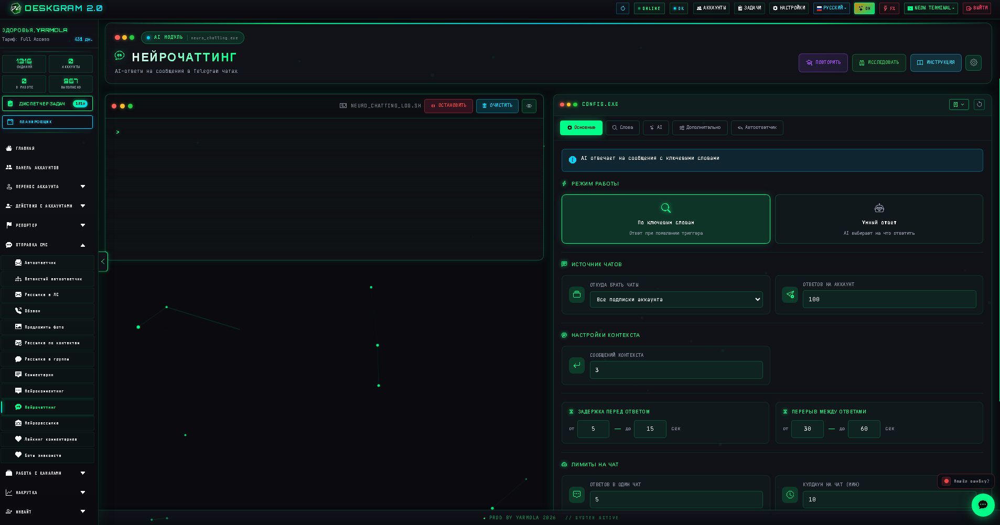
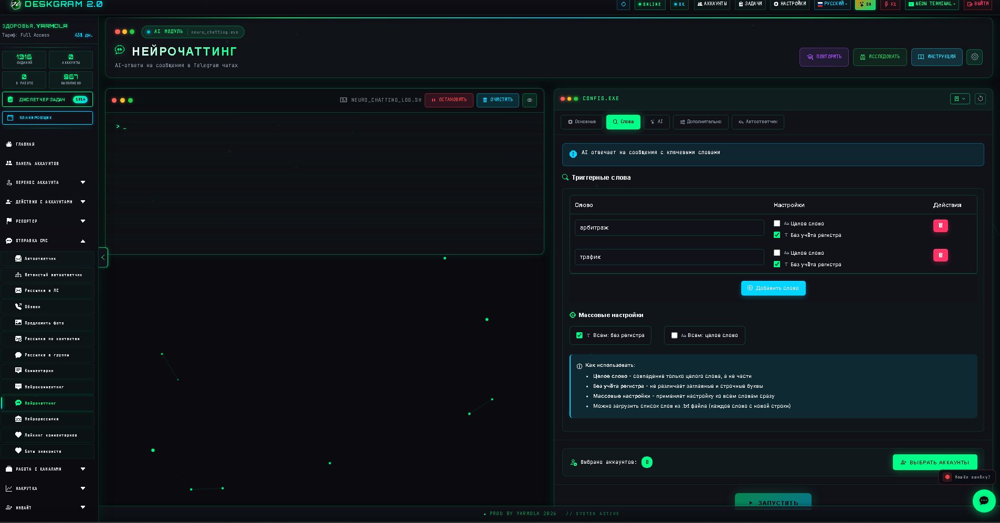
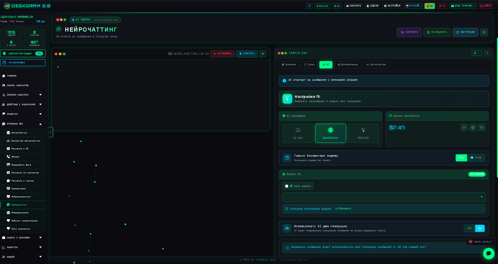
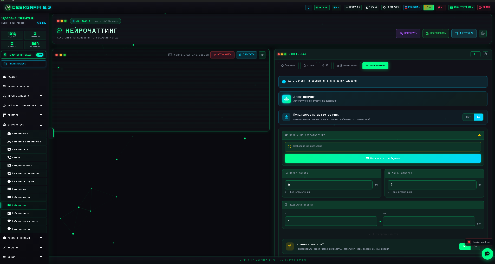

# Нейрочаттинг в Telegram через Deskgram 2

Нейрочаттинг в Deskgram 2 — это AI-модуль для автоматических ответов в Telegram-чатах и группах. Он позволяет реагировать на сообщения по выбранной логике: по всем входящим, по ключевым словам или по другим условиям, используя AI для генерации ответа и дополнительные фильтры поведения.

[Главный хаб Deskgram 2](https://github.com/Deskgram-2/deskgram-2-telegram-automation) · [Сайт](https://deskgram2.com/) · [Telegram-бот](https://t.me/DG2welcomebot) · [Web preview](https://deskgram2.com/web-preview)

## Скриншоты

## Кратко о модуле

| Параметр | Что внутри |
|---|---|
| Основная задача | AI-ответы на сообщения в чатах и группах Telegram |
| Режимы работы | Ответ всем или только по триггерам |
| Важные блоки | Источники чатов, триггеры, AI, автоответчик, фильтрация, анализатор |
| Полезен для | Активности в чатах, прогрева, работы с живыми обсуждениями |
| Связанные модули | Нейрокомментинг, Автоответчик, Нейрорассылка |

## Что умеет нейрочаттинг

- отвечать на сообщения в чатах и группах;
- работать по ключевым словам и триггерам;
- использовать AI для генерации естественных ответов;
- настраивать задержки, лимиты и поведение аккаунтов;
- фильтровать нежелательные сценарии;
- подключать автоответчик и дополнительные правила поведения;
- использовать анализатор чатов и дополнительные фильтры.

## Быстрый старт

1. Выберите рабочий режим и источники чатов.
2. Настройте лимиты, задержки и правила поведения.
3. При необходимости задайте ключевые слова и триггеры.
4. Подключите AI и параметры генерации.
5. Выберите аккаунты и запустите задачу.

## Что обычно усиливает этот сценарий

- [Нейрокомментинг](https://github.com/Deskgram-2/telegram-neuro-commenting-deskgram), если рядом идет AI-активность в комментариях и обсуждениях;
- [Автоответчик](https://github.com/Deskgram-2/telegram-autoresponder-deskgram), если нужен фоновый слой обработки входящих вне групповых триггеров;
- [Панель аккаунтов](https://github.com/Deskgram-2/telegram-account-manager-deskgram), если чаттинг распределяется по сетке аккаунтов;
- [Управление прокси](https://github.com/Deskgram-2/telegram-proxy-manager-deskgram), если важна стабильность инфраструктуры под чатную активность;
- [Настройки](https://github.com/Deskgram-2/telegram-automation-settings-deskgram), если AI и общие параметры должны быть подготовлены заранее;
- [Диспетчер задач](https://github.com/Deskgram-2/telegram-task-manager-deskgram), если хотите контролировать ошибки, подвисания и общий темп сценария.

## Как устроен сценарий

### Основные настройки

Здесь задаются режим работы, источники чатов, лимиты, задержки и базовые ограничения.

### Триггеры

Если нужен выборочный режим, можно отвечать только на сообщения с заданными словами или типами входящих сообщений.

### AI

В AI-блоке выбираются провайдер, модель и параметры генерации ответов.

### Автоответчик и дополнительные правила

Дополнительно можно настраивать:

- правила ответа;
- фильтрацию и исключения;
- анализ чатов;
- поведение аккаунта в чате.

## Когда особенно полезен

- когда нужен AI-активный аккаунт в чатах и группах;
- когда хочется отвечать только на релевантные сообщения, а не на все подряд;
- когда важна живая реакция в обсуждениях и чатах;
- когда сценарий требует сочетания AI и фильтров поведения.

## Почему это сильнее ручной работы в чатах

| Ручной подход | Нейрочаттинг в Deskgram 2 |
|---|---|
| Нужно постоянно дежурить в чатах | Модуль работает по заданным правилам |
| Ответы трудно масштабировать | Можно подключать сетку аккаунтов |
| Сообщения легко пропустить | Есть триггеры и фильтрация |
| Общение быстро выдыхается | AI помогает поддерживать вариативность |
| Сложно держать единый стиль | Параметры задаются централизованно |

## Смежные репозитории

- [Главный хаб Deskgram 2](https://github.com/Deskgram-2/deskgram-2-telegram-automation)
- [Нейрокомментинг](https://github.com/Deskgram-2/telegram-neuro-commenting-deskgram)
- [Автоответчик](https://github.com/Deskgram-2/telegram-autoresponder-deskgram)
- [Панель аккаунтов](https://github.com/Deskgram-2/telegram-account-manager-deskgram)
- [Управление прокси](https://github.com/Deskgram-2/telegram-proxy-manager-deskgram)
- [Настройки](https://github.com/Deskgram-2/telegram-automation-settings-deskgram)
- [Диспетчер задач](https://github.com/Deskgram-2/telegram-task-manager-deskgram)

## FAQ

### Можно ли отвечать только на сообщения по ключевым словам?

Да. Для этого и нужен режим работы с триггерами.

### Зачем здесь анализатор чатов?

Он помогает точнее понимать контекст и применять дополнительные правила поведения.

### Это модуль для всех чатов сразу?

Не обязательно. Можно ограничивать источники и сценарии по нужным параметрам.

### Чем он отличается от обычного автоответчика?

Нейрочаттинг больше сфокусирован на работе в чатах и группах, а также на сценариях с триггерами и более гибким AI-ответом.

## Полезные ссылки

- [Главный хаб Deskgram 2](https://github.com/Deskgram-2/deskgram-2-telegram-automation)
- [Сайт Deskgram 2](https://deskgram2.com/)
- [Telegram-бот Deskgram 2](https://t.me/DG2welcomebot)
- [Web preview](https://deskgram2.com/web-preview)
